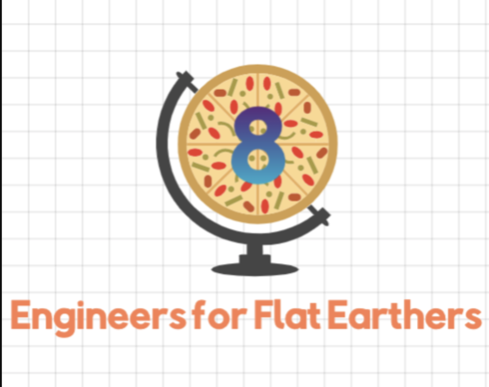

# BuJo by Engineers For Flat Earthers 
Welcome! We are the Engineers for Flat Earthers (Team 8)

## Team 
Mission Statement: Our team strives to challenge societal norms with innovative, flat thinking. We are open to all ideas and opinions for a leveled world. We strive to: Think Future. Think Fast. Think Flat.

Check out our [Wiki](https://github.com/cse110-sp21-group8/cse110-sp21-group8/wiki) for more information about our team and project! Here you will find information about our [CI/CD pipeline](https://github.com/cse110-sp21-group8/cse110-sp21-group8/wiki/CI-CD), our [documentation](https://github.com/cse110-sp21-group8/cse110-sp21-group8/wiki/JSDocs), and our [team members](https://github.com/cse110-sp21-group8/cse110-sp21-group8/wiki/Team-Page).

## Our Product 
We sacrificed our time, energy, and mental health to create a UI-focused Bullet Journal Crud Application. Here is our [onboarding documentation](/onboarding.md) to teach you how to navigate through our repo and utilize our product. Hope you enjoy!

## Our Process 

[Private Video](https://youtu.be/2J-X0AxxSjM)
[Public Video](https://youtu.be/QuXwBWVee7M)

