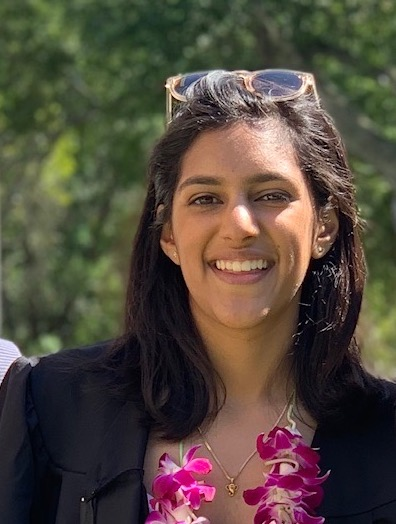

# Team Page

### Team Name: Engineers for Flat Earthers

### [Team Brand](https://github.com/cse110-sp21-group8/cse110-sp21-group8/blob/main/admin/brand.md)

### Team Values:
Our team strives to challenge societal norms with innovative, flat thinking. We are open to all ideas and opinions for a leveled world. We strive to: 
Think Future. Think Fast. Think Flat.

### Team Roster:
[Bruce Haidrey](https://github.com/brucehaidrey24) 
 
Bruce is an inquisitive Mathematics-Computer Science major in his 4th year at Sixth College. He's determined to learn everything there is to know about Software Engineering. Some of Bruce's hobbies include basketball (go Lakers!) and loves to be around nature so he goes on hikes frequently.

[Navika Budhraja](https://github.com/nbudhraj) 
 
Navika Budhraja is a second-year Computer Science Major at Eleanor Roosevelt College. She is an aspiring software engineer who one day hopes to either work at or found a startup. In her free time, Navika loves to play and watch basketball (Go Warriors!), and has recently enjoyed adventuring around San Diego on her bike.

Dennis Luc

[Jinhao Zhou](https://github.com/j5zhou) 
 
Jinhao is a 3rd year CS student at UCSD. He's interested in Web Dev, python, and ML. He loves pokemon and animation.

[Marlon Trujillo](https://github.com/mtrujilloariza) 
 
Marlon is a second year computer science major from Muir College.

[Karen Gong](https://github.com/kwgong) 
 
Karen is a Computer Science major at Eleanor Roosevelt College. Some things she really enjoys are dancing and going on food adventures with friends.

[Bao Nguyen](https://github.com/bao153) 
 
Bao is a senior CS (that is, Cognitive Science) major, minoring in the original CS. He is an aspiring software engineer and is exploring ways machine learning can be applied to helping humans. He loves making food and watching movies, and wishes he could purchase a Zline Professional 48 Inch Wide 6 cu. ft. Slide-In Dual Fuel Range Stove for his house some day.

Zakaria Alhomsy

Dante Tanjuatco

[Chongbo Tang](https://github.com/tangcb26) 
 
Chongbo is a third-year student majoring in Computer Science at Sixth College, who has a particular interest in algorthm design and analysis.

[Dennis Luc](https://github.com/denniskluc) 
 
Dennis is a second-year Computer Science major from Eleanor Roosevelt College. He hopes to be able to learn as much about software engineering as possiblle through CSE 110, and apply the skills he learns to future internships and projects. In his free time, Dennis enjoys hiking, learning how to cook, watching anime, and playing League of Legends!
