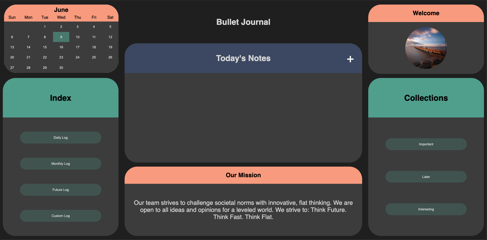
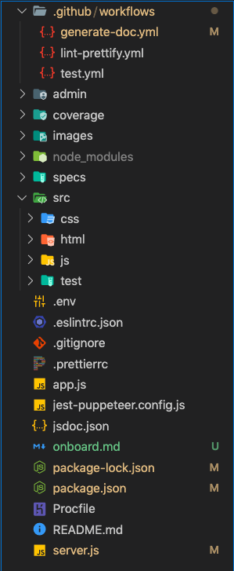
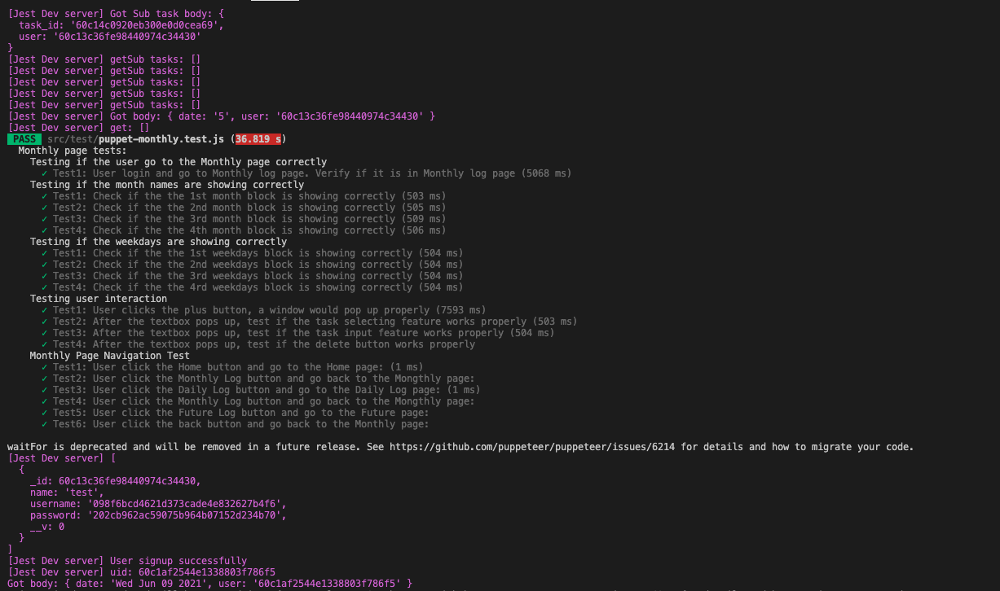
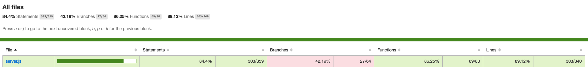

# Quickstart guide:

1. Clone this project to your local machine with `git clone https://github.com/cse110-sp21-group8/cse110-sp21-group8.git`. Then do `git checkout demo` to check out the development branch (if `demo` did not show up as the default branch). The `main` branch is where we store our past meeting notes along with other specification documents.
2. Enter `npm install` into the terminal in the root directory to install necessary node modules for development.
3. Use `npm start` to start the server of our app and check it out via http://localhost:8080.
4. Now you can start coding.

# But wait, what do all the directories and files mean?

- Use the `main` branch to check out the `admin` and `specs` directory. The former is for our group's past meeting notes, and the latter contains specifications of our app, including ADRS documents, past brainstorming session notes and our pitch deck template.
- Back to the `demo` branch, `.github` is the directory containing all the stuff related to Github. Right now we only have the `workflows` directory in it for the yml files of our CI/CD Pipeline which consists of linting-formatting, documentation generation and testing. 
- `coverage` is the place for our test reports.
- `src` is where all the code related to our app's UI resides, plus test files.
  - Inside, there's the `css`, `html`, `js`, and `test` directories which are self-explanatory for 4 main components of our app development: styling, markup pages, Javascript for dynamic interactions with these pages and test files.
- The `.env` file is where you'd store any sensitive environment variable you need during development that you also want on your deployment platform (e.g. Database URL).
- `app.js` and `server.js` are the two paramount files for firing our app server. 
- The rest of the files are configuration files needed for installation, development, and deployment.

# Time to test:

- To test, simply `npm test` in the root directory. It will produce test reports in `coverage`. 
- Currently, unit and UI testing are what we do. 
  - We unit test server API calls for CRUD operations on task- and user-related items with the `supertest` module. 
  - We UI test with the `jest-puppeteer` framework and cover all the main pages of our app and the features thereof: Home, Daily Log, Monthly Log, Future Log. 
- If you take a peek inside of test files, there's some test cases that we commented out; this is because we ran out of time before we figured out how to utilize the `puppeteer` commands properly. We also ran into problems with the testing Github Action where it gives us inconsistent test results even though our tests all passed locally.
- Other than that, you can help us add or fix test cases of our app.

# What about deployment?

1. After development, we deploy using the Heroku CLI. And let's assume that you have access to our Heroku account and have already connected your local repo to the Heroku remote repo. 
2. You want to first `git checkout -b deploy` to create and check out a branch specific for deploying.
3. Go to `server.js` and comment out the line `require('dotenv').config();` because it will cause some problem during deployment later in the Heroku remote.
4. If you accidentally installed the node modules with Yarn, delete `package-lock.json` to signal to Heroku that you want to use Yarn for package-managing because it won't allow `yarn-lock` and `package-lock.json` to co-exist. Otherwise, leave `package-lock.json` be if you're using npm. Importantly, make sure that your frozen lock file is up to date with `package.json`!
5. Then, use `git add` with `git commit` to commit your updated files to the local repo.
6. Now, trust the process and `git push -f heroku deploy:main` to push, build and deploy our app in one command via the Heroku remote!
7. Our app exists at this address: https://flatearth-bujo.herokuapp.com/

# Extras:

- **Scripts**:
  - `npm run lint`: automatically tells you if you have any code that has not been styled/used according to the predefined ESLint rules.
  - `npm run lint --fix`: automatically fixes any code that has not been styled according to the predefined Prettier rules.
  - `npm run doc`: automatically generates JSDoc pages in a new `docs` directory for code that you've commented.
  - `npm run stop`: kill the process of the app immediately (useful in some test cases where the process still lingers even after testing is finished).
  
- **Configurations**:
  - `.eslintrc.json`: config file for ESLint rules.
  - `.prettierrc`: config file for Prettier formatting rules.
  - `jsdoc.json`: config file for JSDoc.
  - `jest-puppeteer.config.js`: config file for jest-puppeteer tests.
  - `Procfile`: includes commands executed by the app on startup after deployment.
